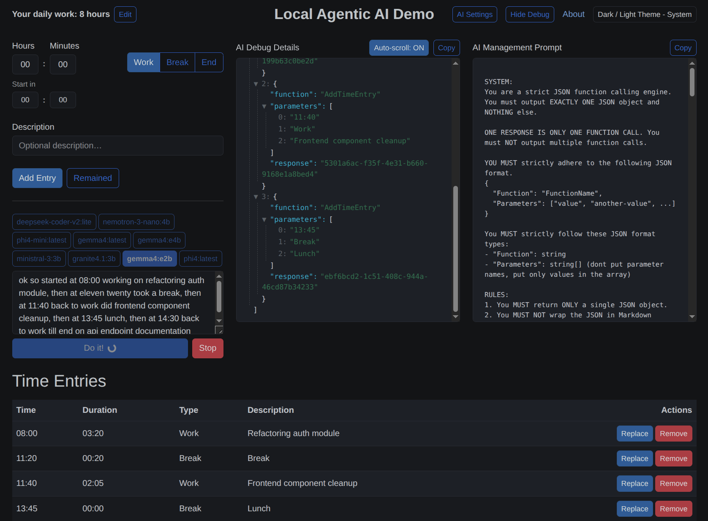

# AI Time Manager

### This project is a demo of Local Agentic LLM Tools execution - implemented by AIOrchestrator NuGet package.

[](https://www.nuget.org/packages/AIOrchestrator)
[](https://github.com/notNullThen/ai-orchestrator-dotnet)

This project demonstrates successful implementation of fully local functions (tools) execution via LLM model.

The tools definition and execution ability is structured and handled by AIOrchestrator NuGet package.

### 🎬 YouTube Video Demo: https://youtu.be/IwAvu0QdGu0

---

- Runs locally
- Uses any local LLM model from Ollama
- Tries to be **model-agnostic**. Currently works well with gemma4:e4b and ministral-3:3b

---



---

## 🚀 Overview

The **Gemma4:e4b** LLM orchestrates a simple time management web app, which results in a complete working day report based on user input.

The orchestration logic is implemented as a reusable AIOrchestrator NuGet package, so it can be plugged into any C# project.

As a result, the LLM calls functions step by step using updated state and history.

---

## Setup & First run

The AI features are powered by [Ollama](https://ollama.com/). By default, it expects the `gemma4:e4b` model, but it can be changed via **AI Settings** button.

1.  **Install Ollama:** Follow instructions at [ollama.com](https://ollama.com/).
2.  **Pull the model:**
    ```bash
    ollama pull gemma4:e4b
    ```
3.  **Run the application**

## Run

### Standard run (recommended):
```bash
dotnet run --project TimeCalculator
```

### Run with network access (accessible from other devices, doesn't support AI yet):
```bash
dotnet run --project TimeCalculator --urls "http://0.0.0.0:8080"
```

### Run with Docker Compose (doesn't support AI yet):
```bash
docker compose up --build
```
